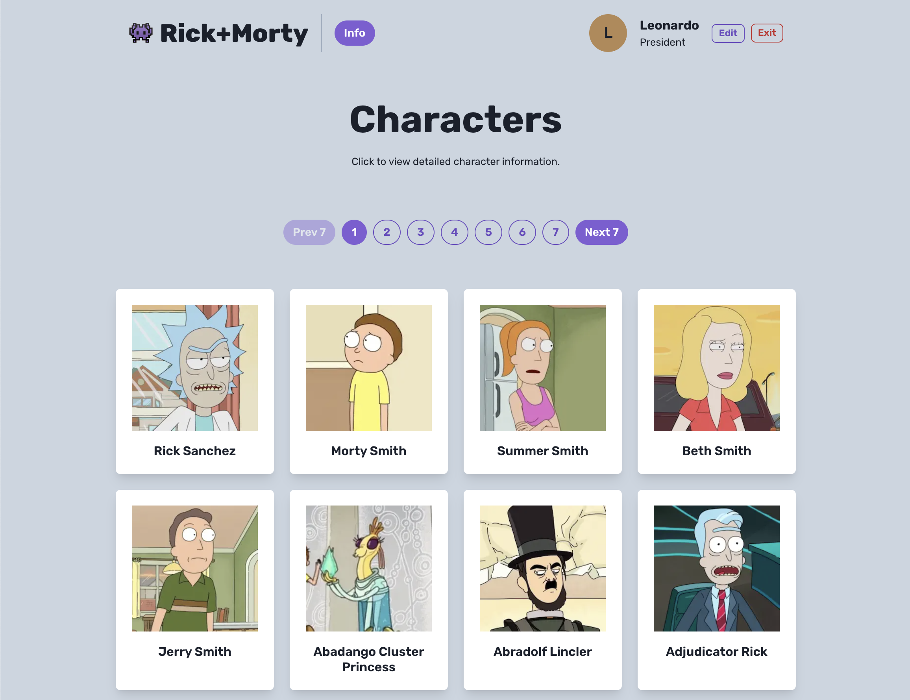

# 👾 Rick & Morty


This is a [Next.js](https://nextjs.org/) `v.14 - app` router project bootstrapped with [`create-next-app`](https://github.com/vercel/next.js/tree/canary/packages/create-next-app) using the `pnpm` package with `Node v20.12.1`.

## Getting Started

After cloning the repository locally, please install the `pnpm` package on your machine. The [easiest way to install](https://pnpm.io/installation#using-homebrew) it is using `brew`.

To run the development server:

```bash
pnpm dev
```

Open [http://localhost:3000](http://localhost:3000) with your browser to see the result.

To run tests:

```bash
pnpm test
```

## Preview



## Design Decisions

- Completing the challenge in a very short time has been a huge learning experience. I wanted to use the `ssr` capability to utilise the now stable `app` directory in `Next.js` with `Apollo GraphQL` integration.
- I encountered a few issues, which I will explain further in the following "Tradeoffs" section.
- Due to time constraints, I did not focus on the styling, although it is responsive and presentable by focusing on the user experience. I treat the project as a "beta" of a Rick & Morty information website.
- I added basic es-lint, prettier, and VSCode settings to maintain code consistency so any developer can maintain the same settings.
- I utilised an EnumAlternativeType utility type that works like enums as an alternative to `enums`. [Why TypeScript enums suck](https://blog.logrocket.com/why-typescript-enums-suck/).


## Tradeoffs

- **Authentication**
  - In the real-world scenario, I will not use `sessionStorage` to store user details. I have tried using the Next.js built-in `cookies`. However, I was stuck trying to set or save values into the browser's cookies on the client side. With more time, the right implementation is to use the Next.js server action to create a `POST` server action. As a tradeoff, I utilised the `useContext` hook and the `sessionStorage`.
  - For real authentication, I will use a third-party library and integrate the `cookies`, as it can be used for setting up middleware to protect routes/pages if a user is not authenticated.
  - Please note, as a workaround for using the middleware, I've created an empty component (`<ProtectedPage/ >`) to trigger auto-redirection if the user accesses protected pages. This is far from perfect; you will see the protected page is still rendered, and there is a delay in the redirection. Previously, the trial of using the middleware and cookies worked well. However, I turned it back to using `sessionStorage` because the `cookies` couldn't be created, as I needed to add a server-side action. From articles, people use third-party libraries such as `next-auth` to help with better authentication.
- **Apollo GraphQL**
  - I implemented a workaround for not using a code generator tool to automatically create explicit TypeScript types due to time constraints in setting it up.
  - As a tradeoff, I created a sample JSON file of the query result to infer the type and modified it accordingly.
- **Pagination**
  - The pagination is simple and could be improved for users to limit the number of characters per page. 
- **Testing**
  - I have installed and configured `Vitest` and `React Testing Library`. However, I did not manage to add automated unit tests. If I write tests, I will test the rendering of pages and components and user interactions. Mocks also contributed to my failure to add tests.
  -  I would add a simple CI/CD to help ensure merging is safe and that tests do not fail if there are any changes.
- **Styling**
  - I kept the styling minimal and utilised `Chakra UI` without much customisation except for setting the component's colour scheme and font. 
- I would clean up the files better, especially separating the types into their own file.
- What was meant to be a 2-hour project ended up taking much more time. However, this experience has taught me so much about the power of perseverance and determination (although I'm quite frustrated that I couldn't get things worked as intended!). Through this project, I have delved deep into the intricacies of the Next.js app router, and it has ignited a desire within me to explore its full-stack capabilities further.


---

<sub>This is a [Next.js](https://nextjs.org/) with `app` router project bootstrapped with [`create-next-app`](https://github.com/vercel/next.js/tree/canary/packages/create-next-app) using the `pnpm` package built with `Node v20.12.1`.</sub>

---

<sub>**Crafted with care ❤ (within a very limited time) by a-sh. in 2024**</sub>.
